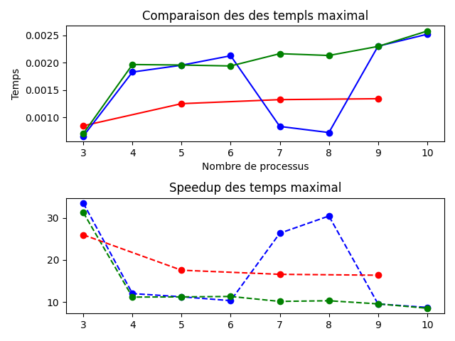
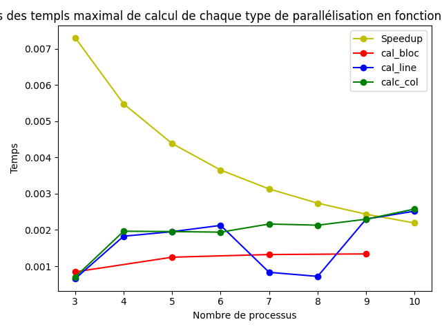
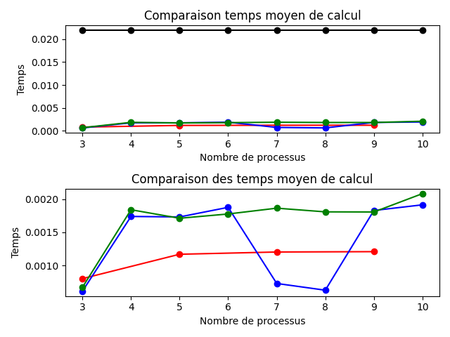

# Le Jeu de la Vie en Calcul Parallèle

## Introduction

Ce projet compare plusieurs implémentations algorithmiques du jeu de la vie. L'objectif est d'évaluer les performances d'un même algorithme implémenté de manière séquentielle et de plusieurs façons en parallèle. On utilise la bibliothèque NumPy pour la partie algébrique, pygame pour l'affichage de la grille, et Message Passing Interface pour Python (mpi4py) pour gérer l'environnement parallèle. Le projet fonctionne avec Python 3.11.5, NumPy 2.2.6, pygame 2.6.1 et mpi4py 4.0.

## Le Jeu de la Vie

Le Jeu de la Vie est un automate cellulaire inventé par Conway. Sur une grille de taille fixée à l'avance, des cellules mortes et des cellules vivantes interagissent avec leurs voisines pour déterminer leur état à l'itération suivante. Concrètement :
- Une cellule vivante avec moins de deux voisines vivantes meurt (sous-population).
- Une cellule vivante avec deux ou trois voisines vivantes reste vivante.
- Une cellule vivante avec plus de trois voisines vivantes meurt (sur-population).
- Une cellule morte avec exactement trois voisines vivantes devient vivante (reproduction).

## Implémentations

Le jeu est implémenté de 4 manières différentes :
- Implémentation séquentielle.
- Implémentation parallèle avec une grille décomposée en plusieurs bloc-lignes.
- Implémentation parallèle avec une grille décomposée en plusieurs bloc-colonnes.
- Implémentation parallèle avec une grille décomposée en plusieurs blocs (pour un nombre pair de processeurs calculateurs).

Dans les implémentations parallèles, les processeurs sont séparés en deux groupes de communication avec la commande `Com.Split(rank != 0, rank)`. Le processeur de rang 0 se charge seul de l'affichage, tandis que les processeurs calculateurs se partagent la grille en blocs afin de réaliser les calculs sur de plus petits morceaux. Chacun traite le bloc qui lui est attribué. Une fois les calculs effectués, seules les coordonnées des cellules ayant changé de statut sont rassemblées sur le processeur calculateur de rang 0, avant d'être envoyées au processeur de rang 0. Ce dernier met alors à jour le statut des cellules concernées et affiche la grille.

## La grille

La grille est un tore avec un nombre infini de cellules : ce qui sort à gauche rentre à droite, et ce qui sort en bas rentre en haut, et vice-versa.

Dans les implémentations parallèles, les blocs représentent des portions à peu près égales de l'ensemble de la grille. Les bloc-lignes contiennent l'ensemble des colonnes et un même nombre de lignes par bloc. Les bloc-colonnes contiennent l'ensemble des lignes et un même nombre de colonnes par bloc.

Pour gérer les cas où le nombre de lignes n'est pas divisible par le nombre de processeurs, on attribue une ligne supplémentaire aux blocs des processeurs dont le rang est inférieur au reste de la division du nombre de lignes par le nombre de processeurs (rang < n_lignes % nb_processeurs). Le même principe s'applique pour la version en bloc-colonnes.

L'implémentation en blocs divise la grille de manière simple et non optimisée. Pour n processeurs calculateurs, on considère la grille comme une matrice de n×n blocs de taille égale. Lorsque le nombre de processeurs calculateurs est pair, chaque processeur prend un bloc rectangle de 2 lignes de blocs par n//2 colonnes de blocs. Lorsque ce nombre est impair, le n-ième processeur prend la dernière ligne de blocs, et les (n-1) premiers se subdivisent les (n-1) premières lignes de blocs comme dans le cas pair.

## Communication inter-blocs et mise à jour des cellules fantômes

### Pour les implémentations en bloc-lignes / bloc-colonnes

Dans les implémentations parallèles, les cellules fantômes sont des groupes de cellules servant à mettre à jour les cellules situées aux extrémités d'un bloc, mais appartenant à un bloc voisin. Par exemple, dans l'implémentation en bloc-lignes avec 5 processeurs calculateurs, le bloc d'indice 2 est encadré par les blocs 1 et 3. Il a besoin de la dernière ligne du bloc 1 pour mettre à jour sa première ligne, et de la première ligne du bloc 3 pour mettre à jour sa dernière ligne.

Pour tenir compte de cela, on ajoute deux lignes aux bloc-lignes (ou deux colonnes aux bloc-colonnes) afin qu'ils puissent accéder aux données de leurs voisins. La ligne 0 du bloc 2 ne sera pas mise à jour : elle correspond à la dernière ligne du bloc 1. De même, la dernière ligne du bloc 2 correspond à la première ligne du bloc 3 et ne sera pas mise à jour. Ces lignes contiennent les cellules fantômes du bloc 2.

Une fois le calcul de la nouvelle itération effectué, chaque bloc communique sa première ligne/colonne au bloc en amont et reçoit la dernière ligne/colonne de ce dernier ; il communique également sa dernière ligne/colonne au bloc en aval et reçoit la première ligne/colonne de celui-ci.

### Différences lignes/colonnes

Les lignes étant des tableaux stockés de manière contiguë en mémoire, on utilise des réceptions non bloquantes suivies d'envois. Pour les colonnes, la situation est plus complexe car elles ne sont pas stockées de manière contiguë. On les convertit donc d'abord en tableaux contigus avec la fonction `numpy.ascontiguousarray()`, puis on effectue un envoi non bloquant que l'on réceptionne dans des tableaux temporaires. On met ensuite à jour les colonnes concernées.

### Implémentation par blocs

La mise à jour des cellules fantômes dans l'implémentation par blocs combine les mécanismes des implémentations bloc-lignes et bloc-colonnes. Les processeurs de rang i pair échangent des colonnes avec le processeur (i+1), et les processeurs de rang i impair échangent des colonnes avec le processeur (i-1). Les échanges de lignes se font avec les processeurs de rang (i+2)%n et (i-2)%n, où n est le nombre de processeurs calculateurs.

Dans le cas où le nombre de processeurs calculateurs est impair, le dernier processeur échange la première moitié de sa première ligne avec le processeur (n-2) et la seconde moitié avec le processeur (n-1). Il envoie la première moitié de sa dernière ligne au processeur calculateur de rang 0 et la seconde au processeur calculateur de rang 1.

## Tests

Indiquer les caractéristiques de la machine sur laquelle les tests sont lancés (nom, marque, nombre de processeurs).

### SpeedUp

Speedup = Temps séquentiel / Temps parallèle(n_processeurs)

##### Objectifs
Comparer différentes stratégies de calcul parallèle afin d’évaluer :

- leur efficacité
- leur scalabilité
- leur impact sur le temps d’exécution

Résultats
Temps maximal de calcul
<<<<<<< HEAD

  

=======

  

>>>>>>> d0fbb1f23e80013f583492906d084eb8b33d0e4c

##### Analyse des courbes :

Le speedup diminue avec l’augmentation du nombre de processus (comportement attendu)
cal_bloc reste stable mais peu performant
cal_ligne montre des fluctuations importantes
cal_col est globalement stable et performant

Temps moyen de calcul
<<<<<<< HEAD

  

=======

  

>>>>>>> d0fbb1f23e80013f583492906d084eb8b33d0e4c

Les temps moyens sont globalement plus faibles
cal_col et cal_ligne offrent de bonnes performances
cal_bloc reste moins efficace
Une limite apparaît avec l’augmentation du nombre de processus (overhead)

### Consommation mémoire
